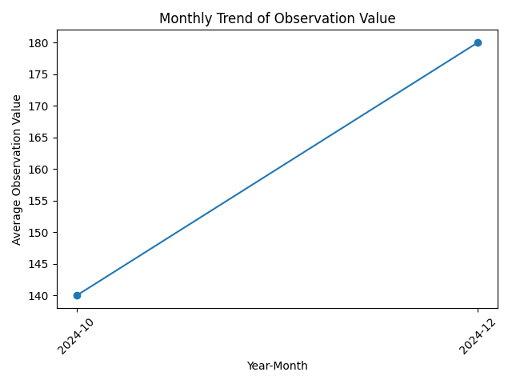

# Clinical Data Analytics Pipeline
**Tech Stack:** Python | Pandas | Matplotlib | Healthcare Analytics


An end-to-end healthcare data analytics pipeline built using Python (Pandas, Matplotlib), transforming raw clinical data into structured insights through data cleaning, feature engineering, and visualization.

## Project Overview

## Project Overview

This project analyzes clinical healthcare data to uncover insights into patient conditions and encounter trends.

It demonstrates a complete data analytics workflow, including data cleaning, transformation, feature engineering, aggregation, and visualization using Python.

The goal is to convert raw clinical data into structured, analysis-ready datasets that support data-driven decision-making in healthcare.

## Business Problem

## Business Problem

Healthcare organizations generate large volumes of clinical data, but much of it remains underutilized due to inconsistent formatting, missing values, and lack of structured analysis.

As a result, it becomes difficult for healthcare professionals and analysts to identify meaningful patterns in patient conditions and trends over time.

This project addresses the challenge by transforming raw clinical data into a clean, structured format that enables reliable analysis and supports data-driven clinical and operational decision-making.


Stakeholders such as healthcare analysts and decision-makers require clear, reliable insights to support better clinical and operational decisions.

## Objectives

* Clean and preprocess raw clinical data to ensure consistency and reliability
* Transform date fields into analysis-ready formats
* Create new features such as patient age and encounter time components
* Perform aggregations to analyze condition-level and time-based trends
* Develop visualizations to communicate insights effectively
* Build a structured and reusable data analytics pipeline

## Dataset Description

## Dataset Description

The dataset contains clinical healthcare records, including patient demographics, encounter details, and observational measurements.

### Key Fields:

* `birth_date` – Patient date of birth
* `encounter_date` – Date of clinical encounter
* `condition` – Medical condition associated with the patient
* `obs_value` – Observational measurement recorded during encounters

The dataset required preprocessing due to missing values, inconsistent formats, and the need for feature engineering.

## Tools & Technologies

* **Programming Language:** Python
* **Libraries:** Pandas, Matplotlib
* **Development Environment:** Visual Studio Code

## Data Cleaning & Preparation

* Standardized column names to ensure consistency across the dataset
* Removed duplicate records to maintain data integrity
* Converted `birth_date` and `encounter_date` to datetime format
* Handled missing values by removing records with missing `encounter_date`
* Validated numerical fields such as `obs_value` for missing, zero, and negative values

## Feature Engineering

* Derived `age` feature from patient birth date
* Categorized patients into meaningful `age_group` segments
* Extracted temporal features including `encounter_year`, `encounter_month`, and `encounter_day`
* Structured time-based variables to enable trend and seasonal analysis


## Exploratory Data Analysis (EDA)

* Analyzed distribution of observation values across different medical conditions
* Computed average observation values using the `condition_summary` dataset
* Examined time-based trends through the `monthly_trend` dataset
* Identified patterns and variations in clinical observations across conditions and time periods

## Visualizations

## Visualizations

### Condition-wise Observation Comparison


### Monthly Trend Analysis




## Key Insights

## Business Impact

## Key Insights

* Patients with diabetes show higher average observation values compared to hypertension
* Observation values exhibit a consistent trend over time
* Aggregated datasets simplify interpretation of clinical data
* Feature engineering enables deeper analysis of patient demographics and trends


## Outputs

The following outputs were generated during the project:

* `cleaned_data.csv` – Processed and cleaned dataset
* `condition_summary.csv` – Aggregated data by medical condition
* `monthly_trend.csv` – Time-based trend analysis
* `final_dataset.csv` – Final enriched dataset with engineered features
* Visualizations (PNG) – Charts for condition comparison and monthly trends

## Project Structure

## Project Structure

CLINICAL_MODELING/
├── data/
│   ├── raw/
│   ├── processed/
│   └── visuals/
├── notebooks/
│   └── data_transformation.py
└── README.md


## How to Run This Project

1. Clone the repository:

```bash
git clone https://github.com/Babaraslamraja/clinical-data-analytics-pipeline
```

2. Navigate to the project folder:

```bash
cd CLINICAL_MODELING
```

3. Install required libraries (run in terminal or command prompt):

```bash
pip install pandas matplotlib
```

4. Run the data transformation script:

```bash
python notebooks/data_transformation.py
```

5. Outputs will be generated in:

* `data/processed`
* `data/visuals`

## Future Improvements

* Integrate interactive dashboards using tools like Power BI or Tableau
* Apply advanced analytics or machine learning for predictive insights
* Expand dataset to include more clinical variables and patient history
* Automate the data pipeline for real-time data processing

## Author

**Dr Babar Aslam**
Data Analyst | Healthcare Analytics | Python

🔗 LinkedIn: https://www.linkedin.com/in/babar-aslam-4b5b38392

